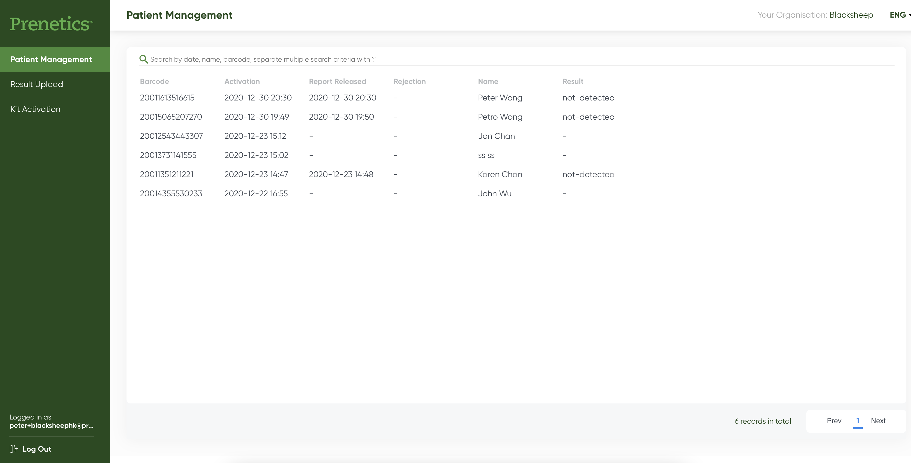

# Backend Engineering Challenge

Prenetics Platform is a multi-tenant platform that offers individual organisations such as clinics and hospitals to manage their customers and patients data and test results. 

Here is a screenshot of the our patient management portal. It has a Patient Management page that allows an organisation administrator to view and search details about organisation’s patients. The Patient Management page should support organisation specific search across many organisations. For the purpose of this challenge, we have two organisations: Prenetics and Circle

## Technical Stack
Our technical stack is TypeScript on PERN (Postgres, Express, React, NodeJS). Our APIs follows JSON:API format.

## Prerequisite
As a prerequisite, you should follow the following instructions to set up and run the backend test service for the patient management portal locally

1. Checkout https://github.com/Prenetics/prenetics-backend-assignment
2. Read README.md and prepare your development environment 
3. `docker-compose up -d --build` – This will build and set up swagger, postgres and service
4. Go to `http://localhost:9080/swagger/` to interact with the APIs – the GET endpoint you would need to interact is “Get results of organisation”. This endpoint currently only returns mock data. This is the main endpoint for this exercise.

## Challenge
The repository https://github.com/Prenetics/prenetics-backend-assignment contains the source code of the patient management service. It is designed to be run locally using Docker Compose (see [README.md](https://github.com/Prenetics/prenetics-backend-assignment/blob/main/README.md))

For this exercise, the function to be implemented is [search.ts](https://github.com/Prenetics/prenetics-backend-assignment/blob/main/src/component/search.ts). 

1. Extend the service to allow paginating test results (15 results per page) such that the endpoint returns the following details
    * patient name
    * sample barcode
    * activation date
    * result date
    * result value
2. Extend the endpoint to search by the following:
    * patient name
    * sample barcode
    * activation date
    * result date
3. Extend the endpoint to allow another organisation to return the following extra fields about their result:
    * result type (RT-PCR, Antigen, Antibody)
    * patient ID
4. Extend the endpoint to search by patient ID.
5. For each step, show how you test your changes.
